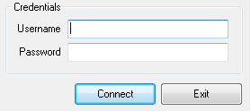

.. contents::
    :local:
    :depth: 2
    :backlinks: none

###################################
在實驗室以外連線回 Server (Windows)
###################################

VPN 設定
========

在實驗室以外的地方，使用 `VPN`_ 的方式連回 Server

.. _VPN: http://zh.wikipedia.org/zh-hant/%E8%99%9B%E6%93%AC%E7%A7%81%E4%BA%BA%E7%B6%B2%E8%B7%AF

所需要的檔案共有兩個：

- 連線的程式
- 實驗室的 Key 檔

請注意！實驗室的 Key 檔形同把關實驗室網路的鑰匙，請妥善保存並不要公開在網路上。

點選 exe 檔安裝 VPN Client 端程式。使用預設設定安裝，過程中會提示安裝額外的網路介面與驅動。

安裝完畢後，執行 ``Access Manager`` 此 Client 端程式

選擇「File」 -> 「Import」，選擇另一個 Key ( ``CGM.vpn`` )檔

.. image:: pics/vpn_connect.png
    :align: center

程式畫面中會多一個圖示，點選它並按下「Connect」

此時會要求輸入 Username 與 Password，輸入隨附的帳號密碼。

如此即完成 VPN 連線建立，可以使用瀏覽器觀看 http://172.16.0.171/ ，應能顯示 Apache 歡迎網頁。

按下「Disconnect」便會關閉 VPN 連線。

---------------

SSH 連線
========

目前實驗室只開放使用 SSH 連回主機。在 Windows 上使用 SSH 有以下幾個套件：

- `MobaXterm`_
- `Putty`_

.. _MobaXterm: http://mobaxterm.mobatek.net/
.. _Putty: http://www.chiark.greenend.org.uk/~sgtatham/putty/download.html

上 / 下傳檔案可以使用 `FileZilla`_ 來處理，同樣走 SFTP(SSH) 方式。

.. _FileZilla: https://filezilla-project.org/

這邊以 ``172.16.0.171`` 作示範，使用時都要 **先建立VPN連線**

Putty
-----

從 `官網`__ 選擇 `The latest release version` For Windows on Intel x86 ``putty.exe`` 。此即為連線的執行程式，可以放在任何位置。開啟即執行 Putty 程式。

__ Putty_

在 Host Name 中，填入「 ``帳號名@主機位置`` 」。以我 (帳號： ``liang`` ) 連線至 171 主機為例，Host Name 即為 ``liang@172.16.0.171`` 。如圖設定後即可以連線。

頭一次連線時，會要新增該主機的 SSH public key，確認即可。

輸入密碼後就完成 SSH 登入。

 
MobaXterm
---------

連線到 `官網`__ 後，我們選擇 Personal Edition (installer) 下載安裝即可。執行桌面上的程式。

__ MobaXterm_

MobaXterm 擁有華麗的介面，打開後即擁有一個類 Unix 的終端機。連線 SSH 只需輸入 ``ssh 帳號名@主機位置`` 即可以連線。

.. code-block:: bash
    
    $ ssh liang@172.16.0.171
    # Permanently added '172.16.0.171' (RSA) to the list of known hosts.
    liang@172.16.0.171's password:
    Last login: Sun Aug 18 22:35:49 2013 from 192.168.193.157
    liang@171 ~ $
    
