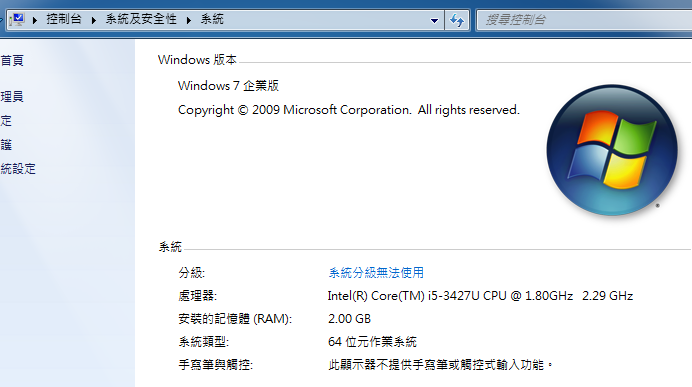
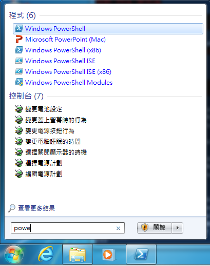
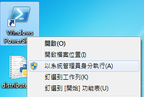

.. contents::
    :local:
    :depth: 2
    :backlinks: none

#############################
在 Windows 上設定 Python 環境
#############################

在 Windows 上安裝 Python 3.3.2
==============================

這邊使用 Windows 7 (64bit) 為主作示範。參考 `The Hitchhiker's Guide to Python`__ 上的環境設定教學。

__ http://docs.python-guide.org/en/latest/starting/install/win/

官方 Windows Installer
----------------------

從官網 http://python.org/download/ 下載給 Windows 的最新安裝檔。目前 (2013.08) Pyhton 3 最新版本下載檔為

- `Python 3.3.2 Windows X86-64 MSI Installer`__ (64bit)
- `Python 3.3.2 Windows x86 MSI Installer`__ (32bit)

__ http://python.org/ftp/python/3.3.2/python-3.3.2.amd64.msi
__ http://python.org/ftp/python/3.3.2/python-3.3.2.msi

請根據個人的電腦規格選擇正確的版本。

32/64 bit 的判斷方法可以至「控制台」-> 「系統及安全性」-> 「系統」來查看。

照著預設設定即可以完成 Python 安裝。

Windows Powershell 執行 Python
------------------------------

Python 預設會安裝在 ``C:\Python33`` 路徑下，這邊即使用此路徑來作設定。

我們使用 ``PowerShell`` 來執行 Python，可以透過「開始功能表」搜尋「powershell」程式

PowerShell 為 Windows 開發類 Bash 的終端機，讓平常常用的 Unix 指令也可以在 Windows 環境上使用。為了讓 PowerShell 能找到 Python 的 exe 執行程式，我們需要設定 ``$PATH`` 環境變數。

在 PowerShell 中輸入以下指令：

.. code-block:: 

    [Environment]::SetEnvironmentVariable("Path", "$env:Path;C:\Python33\;C:\Python33\Scripts\", "User")

重新啟動 PowerShell 後，使用指令 ``gcm`` 或 ``Get-command`` 來判斷 PowerShell 有沒有找到 ``python.exe`` ，以及 ``$env:path`` 有沒有被正確的設置

.. code-block:: powershell

    PS > Get-command python     # Alias to gcm
    #
    # CommandType     Name            Definition
    # -----------     ----            ----------
    # Application     python.exe      C:\Python33\python.exe
    #
    PS > $env.path
    # %SystemRoot%\system32\WindowsPowerShell\v1.0\;C:\Program Files (x86)\Parallels\Parallels Tools\Applications;C:\Windows\system32;C:\Windows;C:\Windows\System32\Wbem;C:\Windows\System32\WindowsPowerShell\v1.0\;C:\Python33\;C:\Python33\Scripts\
    
現在環境變數設定成功，輸入 ``python`` 即可以進入 Python 互動式介面，輸入 ``Ctrl+Z`` 即可結束

.. code-block:: powershell

    PS > python      # 進入 Python interactive console，執行 print() 指令
    Python 3.3.2 (v3.3.2:d047928ae3f6, May 16 2013, 00:06:53) [MSC v.1600 64 bit (AMD64)] on win32
    Type "help", "copyright", "credits" or "license" for more information.
    >>> print('Hello Windows')
    Hello Windows
    >>> ^Z

    PS >             # Ctrl+Z 離開 Python 回到 PowerShell

管理 Python 套件
================

Distribute + Pip
----------------

此步驟需要網路下載相關的套件。

.. code:: powershell

    PS C:\Users\Liang Bo Wang> cd .\Desktop     # 切換至檔案下載目錄
    PS C:\Users\Liang Bo Wang\Desktop> python .\distribute_setup.py
    ## 開始安裝 distribute 套件，略過長長的安裝訊息
    ## ...
    # Installed c:\python33\lib\site-packages\distribute-0.6.49-py3.3.egg
    # Processing dependencies for distribute==0.6.49
    # Finished processing dependencies for distribute==0.6.49
    # After install bootstrap.
    # Creating C:\Python33\Lib\site-packages\setuptools-0.6c11-py3.3.egg-info
    # Creating C:\Python33\Lib\site-packages\setuptools.pth

    PS > easy_install --help     # 正確安裝會印出 Help 訊息

完成後會有新增一個 ``easy_install`` 指令，可以用來管理 Python 套件使用。但我們會再安裝它比較新的好兄弟 ``pip`` 來作管理

.. code-block:: powershell

    PS > easy_install pip
    # Searching for pip
    ## 過程略 
    ## ...
    # Installed c:\python33\lib\site-packages\pip-1.4.1-py3.3.egg
    # Processing dependencies for pip
    # Finished processing dependencies for pip

    PS > pip freeze     # 印出現在系統安裝的所有套件
    # distribute==0.6.49  # 目前只有安裝 distribute (easy_install) 套件

Virtualenv (Advanced)
==============================

為了避免安裝套件的過程中，會在系統資料夾中更動，安裝多個套件有時會有相衝的情形。這時候如果要移除某些套件，難免會有清除不乾淨，或者無法回復更改設定的情形出現。

為了解決開發時經常安裝移除套件，以及同個套件但多個版本共存的狀況，我們可以建立出 Python 虛擬的安裝環境，透過切換安裝環境來達到隔離套件群的目標。

目前最為成熟的虛擬環境套件為 `Virtualenv`__ ，透過它可以在不同的目錄下設立自己的環境，而這些套件相關的檔案便會各自安裝在自己的目錄中。

__ http://www.virtualenv.org/en/1.10.1/

安裝
----

使用 ``pip`` 標準方式安裝

.. code-block:: powershell

    > pip install virtualenv

PS1、簽章認証設定
-----------------------

如果參考官網的方式建立環境的話，預設會出現錯誤訊息：

.. code-block:: powershell

    > virtualenv venv           # 建立名為 venv 的環境
    > cd venv
    > .\Scripts\activate        # 啟動虛擬環境
    # C:\Users\Liang Bo Wang\venv\Scripts\activate.ps1 檔案無法載入，因為這個系統上已停用指令碼執行。如需詳細資訊，請參閱 "get-help about_signing"。
    # 位於 行:1 字元:23
    # + .\Scripts\activate.ps1 <<<<
    #     + CategoryInfo          : NotSpecified: (:) [], PSSecurityException
    #     + FullyQualifiedErrorId : RuntimeException

這是因為預設 PowerShell 有限制使用者修改 PS1 的權限，我們必須更改成接受「經過簽章」(RemoteSigned) 的設定。這時需要使用「系統管理員」的身份執行 PowerShell

.. code-block:: powershell

    C:\Windows\system32> Set-ExecutionPolicy RemoteSigned
    # 
    # 執行原則變更
    # 執行原則有助於防範您不信任的指令碼。如果變更執行原則，可能會使您接觸到 about_Execution_Policies
    # 說明主題中所述的安全性風險。您要變更執行原則嗎?
    # [Y] 是(Y)  [N] 否(N)  [S] 暫停(S)  [?] 說明 (預設值為 "Y"): Y
    C:\Windows\system32> 

再次 activate 環境便不會有錯誤訊息。

使用方式
--------

**建立名為 venv 的虛擬環境**

會在當前目錄下，建立 ``venv`` 這個資料夾，此即為虛擬環境的根目錄

.. code-block:: powershell

    > virtualenv venv

**使用 venv 虛擬環境**

執行虛擬環境內的 ``.\Scripts\activate`` 此時 PS1 會多一個 ``(venv)`` 指示當前虛擬環境的名稱。

.. code-block:: powershell

    > cd .\venv
    venv> .\Scripts\activate
    (venv) venv>                        # 前面多了一個 (...) 顯示現在虛擬環境的名稱
    (venv) venv> Get-Command pip        # 會發現改使用 venv 底下的 pip 而非系統的 pip
    #     
    # CommandType     Name          Definition
    # -----------     ----          ----------
    # Application     pip.exe       C:\Users\Liang Bo Wang\venv/Scripts\pip.exe
    # Application     pip.exe       C:\Python33\Scripts\pip.exe
    #
    (venv) venv> Get-Command python     # Python 路徑一樣會被重設
    #
    # CommandType     Name                                                Definition
    # -----------     ----                                                ----------
    # Application     python.exe                                          C:\Users\Liang Bo Wang\venv/Scripts\python.exe
    # Application     python.exe                                          C:\Python33\python.exe
    #

**退出 venv 虛擬環境**

.. code-block:: powershell

    (venv) > deactivate         # 退出虛擬環境
    > 

**於虛擬環境中安裝套件**

使用方式完全相同於系統的 Python，只是現在套件會安裝到虛擬環境 (``venv``) 底下。這邊以 ``nose`` 這個套件為例：

.. code-block:: powershell

    > .\venv\Scripts\activate   # 使用 venv 環境
    (venv) > pip install nose   # 虛擬環境中安裝 nose
    (venv) > pip freeze         # 查看 venv 內安裝的所有套件
    # nose==1.3.0
    (venv) > deactivate         # 離開 venv
    > pip freeze                # 系統並沒有安裝 nose 此套件
    # distribute==0.6.49
    # virtualenv==1.10.1

任何時間移除 ``rm -r venv`` 都不會對系統有任何的影響，非常適合安裝不知名，或還在開發中的套件。
